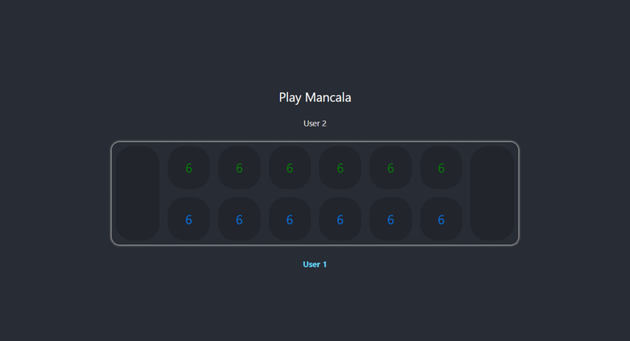

# Mancala Game

## Description
[Mancala](https://en.wikipedia.org/wiki/Mancala) is a two-player turn based game.
This is a Java implementation of it developed using Spring Boot.
Every game session and their states are stored in in-memory H2 database.

There two endpoints available on the backend:
 - Creating the game session: ```/api/v1/game/create```
 - Moving stones from a chosen pit: ```/api/v1/game/play```

React is used to create the user interface of this game.
Since game state changes after every turn it is appropriate to use a framework like React to minimize the need for writing code.

## Game Play


## Installation
In order to run the backend application at least JDK 11 is required. For the frontend, make sure to use the latest version of Node to get better performance.
To start up the application on your local machine, select **"local"** maven profile and click run on your IDE.
Alternatively, you can achieve the same by executing this maven goal **"mvn spring-boot:run -Plocal"**.
After Spring Boot application starts, you need to start up the React application by simply running **"npm start"** under ***"/src/main/frontend"*** directory. 

In local environments, backend is accessible only from the origin ```http://localhost:3000``` which is the default local address for React applications. 
If you want to change this default behaviour you need to modify the property *bol.com.mancala.cors.allowed-origins* in the [application-local.yaml](./src/main/resources/application-local.yaml) file.

## Usage
### Creating New Game Session ```POST /api/v1/game/create```
#### Request Body
```
{
  "firstPlayerId": "1", // required
  "secondPlayerId": "2", // required
  "initialStoneCount": "6", // optional
  "activePlayer": "0" // optional
}
```
#### Response Body
```
{
    "id": "3980ff01-ec08-4cc4-9a3e-712c03ab5151",
    "version": 0,
    "createdDate": "2021-12-18T22:16:07.191177+03:00",
    "lastModifiedDate": "2021-12-18T22:16:07.191177+03:00",
    "firstPlayerId": 1,
    "secondPlayerId": 2,
    "initialStoneCount": 6,
    "activePlayer": 0,
    "winner": -1,
    "finished": false,
    "board": {
        "id": 1,
        "pits": [
            [6, 6, 6, 6, 6, 6, 0],
            [6, 6, 6, 6, 6, 6, 0]
        ]
    }
}
```
### Creating New Game Session ```GET /api/v1/game/play/{gameId}?pit={index}```
#### Response Body
```
{
    "id": "3980ff01-ec08-4cc4-9a3e-712c03ab5151",
    "version": 0,
    "createdDate": "2021-12-18T22:16:07.191177+03:00",
    "lastModifiedDate": "2021-12-18T22:16:07.191177+03:00",
    "firstPlayerId": 1,
    "secondPlayerId": 2,
    "initialStoneCount": 6,
    "activePlayer": 0,
    "winner": -1,
    "finished": false,
    "board": {
        "id": 1,
        "pits": [
            [0, 7, 7, 7, 7, 7, 1],
            [6, 6, 6, 6, 6, 6, 0]
        ]
    }
}
```


## License
This project is licensed under the MIT License - see the [LICENSE](LICENSE) file for details.
